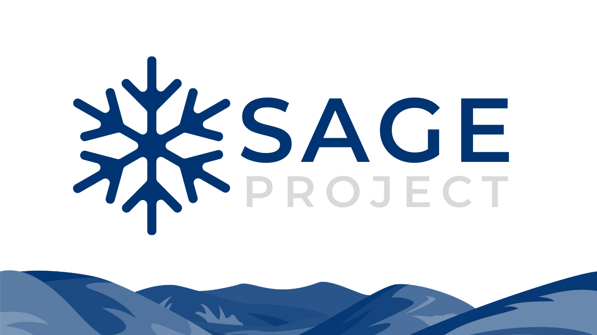

# Sage Discord Bot


```
Winner of Novice Hackathon: Best Overall
```
Submitted to Steel City Hacks 2024: Winter Hackathon

Devpost: https://devpost.com/software/sage-67v1d2

Original Replit: https://replit.com/@JonathanZhou11/Sage

Video/Demo: https://youtu.be/dCroCDpMsyw


## Inspiration
Our team's inspiration came from our previous experience at a hackathon where we developed a Discord bot called "Academic Weapon" aimed at aiding individuals with their academic pursuits. Reflecting on our past project, we felt compelled to increase our efforts for this hackathon. We aimed to create a more sophisticated and complex Discord bot by incorporating machine learning technologies.

## What it does
Sage is a Discord bot designed to assist individuals uncertain about whether they're experiencing Seasonal Affective Disorder (SAD) by providing more information about the condition. Sage is accessible to users of any age or gender, showcasing a user-friendly interface that grants effortless access to its array of features. Additionally, being hosted on Replit and accessed on Discord ensures a consistently easy-to-use design theme.

## How we built it
We built it using Replit, with Python as our language of choice. Our approach also involved applying ideas from online resources and YouTube tutorials to implement machine-learning and bot functions into our project. We utilized tools such as Pycord, sklearn, discord.commands / discord.py, and BeautifulSoup to create features that wouldn't have been possible without them.

## Challenges we ran into
During the project development process, we initially struggled with determining the direction of our project. Machine learning wasn't our primary consideration at the start, as none of us had experience with it. However, driven by a desire to push our boundaries and embrace challenges, we eventually decided to incorporate machine learning into our project. This decision significantly contributed to the challenge of our project, making it a challenging experience for our team. Another challenge we had was increasing the accuracy of our machine-learning model as getting quality training sets and balancing good/bad training sets was difficult.

## Accomplishments that we're proud of
The accomplishment that we’re proud of is actually turning our initial machine-learning concept into reality, which was to assist individuals who are uncertain whether they’re experiencing SAD by providing more information to them. We are really proud of this achievement because it is our first time entering the world of Machine Learning and creating a real-world solution with it. We are also proud of being able to create such a complex Discord bot in less than 10 days while dealing with school and our personal lives.

## What we learned
We learned more about Python and Discord bot coding as well as machine learning while working on this project. We learned about how a machine learning model is built and works through the model’s accuracy, behaviour, and patterns. since We had training sets and an array of data from the web to back up its performance. We also learned that the model needs enough quantity and quality of data to output accurate information. Since we lacked data for the training sets, the machine learning model doesn't have enough data to judge what is good and bad.

## What's next for SAGE
Sage has the possibility to be more than just a Discord bot. Just through the concept of Sage alone, Sage can be implemented anywhere! Whether it be a website or an app, Sage is able to help millions of people worldwide. If we had more time and resources, we could make Sage into an app, allowing users who do not have Discord to access Sage.

